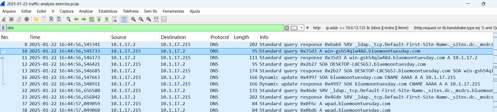
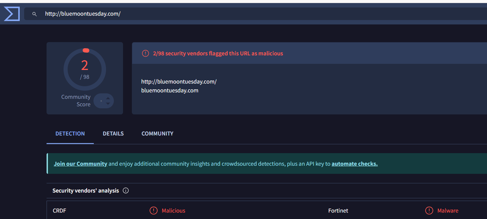

# Análise de Tráfego de Malware com Wireshark (Dowload de software falso)

##  Ferramentas Utilizadas
- Wireshark
- VirusTotal
- Arquivos PCAP obtidos de fontes públicas educacionais (Malware Traffic Analysis)## 📸 Captura de Tela – Análise no Wireshark

##  Análises Realizadas
- Identificação de endereços IP suspeitos
- Análise de consultas DNS
- Inspeção de tráfego HTTP
- Observação de padrões anormais de comunicação na rede

## Principais Descobertas
- Muitas requisições DNS para domínios suspeitos
- Tráfego HTTP incomum
- Indicadores compatíveis com comportamentos conhecidos de malware no site VirusTotal

## 📚 Habilidades Praticadas
- Análise de tráfego de rede
- Inspeção de pacotes
- Fundamentos de cibersegurança

## 📚 Habilidades Praticadas
- Análise de tráfego de rede
- Inspeção de pacotes
- Fundamentos de cibersegurança

